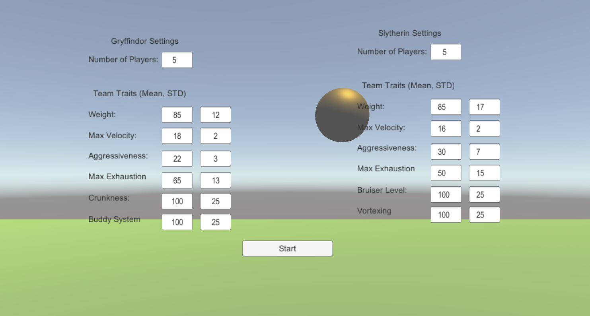

# QuidditichSwarm
Quidditch is a game for wizards where two teams fly on broomsticks to try and catch a golden snitch while dodging bludgers, quafflers, wafflers, etc.
Who am I kidding? You don't really care about that do you?


This project is a simplified implementation of Quidditch in Unity using a multi-agent swarm paradigm to simulate the two teams.

Each player has has a set number of forces propelling them through the world. One force leads them towards the snitch, another pushes them away from colliding with teammates. The forces can be visualized using the in-game debug menu. The goal of the game is to try and catch the snitch. Each time a member of a team catches a snitch, their team will score a point. If a team successively captures the snitch before the other team scores a point, then that team will gain a bonus point. The game ends when a team reaches a score of 100.
![Big Swarm](GIFS/Big Swarm.gif

## Mechanics
### Agent States
Players start out in the **Conscious** state where they chase the snitch and exhibit behaviours as per their traits listed below. If an agent comes into contact with the environment, or another player, there is a chance they will become **Unconscious** where the only force acting on the agent is the force of gravity. Finally, once an unconscious player hits the ground, they will transition to the **Waiting** state. In the Waiting state, the player is teleported back to their starting location and must wait a determined amount of time before becoming Conscious again and rejoining the game.

### Exhaustion
Each player has an exhaustion level that will increase as they fly around. If their exhaustion level surpasses the "max exhaustion" parameter then that player will become unconscious and fall to the ground. The rate of exhaustion is calculated as the ratio of a player's current speed over their maximum speed. The faster a player flies, the faster they will tire out.

If a player is close to exhaustion, they will slow down to try and lower their exhaustion levels. This process is reliant on random number generation so sometimes players will run themselves until exhaustion, other times they will slow down and prevent themselves from passing out.

### Tackling
When two players on opposing teams come into contact with each other, a calculation determines which player becomes unconscious and which player carries on. The calculation is resolved as such:
```
Player1Value = player1.Aggressiveness* (rng.NextDouble()* (1.2 - 0.8) *(1 - (player1.exhaustion / player1.maxExhaustion))
Player2Value = player2.Aggressiveness* (rng.NextDouble()* (1.2 - 0.8) *(1 - (player2.exhaustion / player2.maxExhaustion))
```
The player with the lower value becomes unconscious.

## Instructions
1. Download or clone repository
2. Open in Unity Editor 

### Main Menu
From the main menu you can change the values that will be used during the simulation. You can also change the number of players on each team.


## Controls
W,A,S,D - Move Camera Forward, Backwards, Left, Right <br />
Q,E - Rotate Camera <br />
CTRL - Move Camera Down <br />
Space - Move Camera Up <br />

## Team Traits 
The stats of players on both teams are randomly determined based on the values entered at the main menu. You can enter in the mean value and std, and the game will automatically generate random parameters based on those input values.

### Traits Common to Both Teams.
**Weight** - How heavy a player is. Will affect their momentum and speed.

**Max Velocity** - Pretty self-explanatory. The speed limit for each player.

**Aggression** - This value dictates the likelihood a player will become unconscious when they come into contact with an opposing player.

**Max Exhaustion** - The maximum amount of exhaustion this player can experience before becoming unconscious.

### Gryffindor Traits
**Crunkness** - Harry's been hitting the skooma pipe again. This trait makes the players all wibbly-wobbly like.


**Buddy System** - Gryffindor's are like crips, they like to stick together.


**Buddy System** - Gryffindor's like to stick together...maybe a bit too much.

### Slyther Traits
**Bruiser** - Slytherins are generally not nice. This trait causes players to try and ram the opposing players into submission ( ͡° ͜ʖ ͡°)


**Vortexing** - Slytherins will coordinate to vortex around the center of their local neighbourhood.


## Ingame Debug Menu
The features of the ingame debug menu are available **ONLY IN THE UNITY EDITOR**.


# Credits
All code is written by me (Michael Wahba) unless otherwise specified.
Quidditch player models created by me.

Environment Assets - https://assetstore.unity.com/packages/3d/environments/landscapes/simple-low-poly-nature-pack-157552


